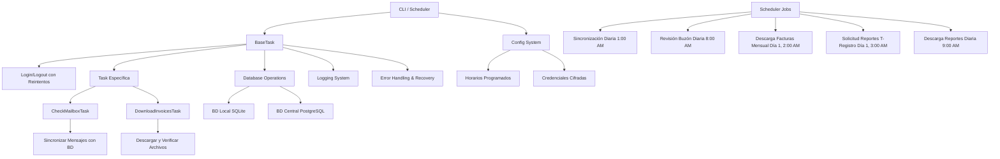

# Driver SUNAT

Un sistema de automatización para interactuar con el portal de la Superintendencia Nacional de Aduanas y de Administración Tributaria (SUNAT) de Perú. Este proyecto permite automatizar tareas como la revisión del buzón electrónico, descarga de facturas y sincronización de datos utilizando Selenium WebDriver y bases de datos locales y centrales.

## Características

- **Automatización de Login**: Manejo seguro de autenticación en el portal SOL de SUNAT con soporte para múltiples contribuyentes.
- **Revisión de Buzón Electrónico**: Automatización completa para acceder y sincronizar mensajes del buzón electrónico de SUNAT.
- **Descarga de Facturas**: Framework preparado para descargar facturas en rangos de fechas específicos (implementación en progreso).
- **Programación de Tareas**: Uso de APScheduler para ejecutar tareas automáticamente en horarios definidos.
- **Gestión de Bases de Datos**: Integración con base de datos local (SQLite) y central (PostgreSQL) para almacenamiento y sincronización de datos.
- **Seguridad**: Cifrado de contraseñas utilizando Fernet (cryptography library).
- **Interfaz de Línea de Comandos**: CLI intuitiva construida con Click para facilitar el uso y la configuración.

## Instalación

### Prerrequisitos

- Python 3.8 o superior
- Google Chrome instalado (para Selenium WebDriver)
- Acceso a una base de datos PostgreSQL (para la BD central)

### Pasos de Instalación

1. **Clona el repositorio**:
   ```bash
   git clone <url-del-repositorio>
   cd driver_sunat
   ```

2. **Instala las dependencias**:
   ```bash
   pip install -r requirements.txt
   ```

3. **Configura las variables de entorno**:
   Crea un archivo `.env` en la raíz del proyecto con las siguientes variables:
   ```
   ENCRYPTION_KEY=<clave-de-cifrado-segura>
   PG_HOST=<host-de-postgresql>
   PG_PORT=5432
   PG_DBNAME=<nombre-de-la-base-de-datos>
   PG_USER=<usuario-postgresql>
   PG_PASSWORD=<contraseña-postgresql>
   ```

   **Nota**: La `ENCRYPTION_KEY` debe ser una cadena segura de 32 caracteres (o generada con `os.urandom(32).hex()`).

## Configuración

### Inicialización de la Base de Datos

Antes de usar el sistema, inicializa la base de datos local:

```bash
python main.py init_db
```

Este comando crea las tablas necesarias en SQLite local.

### Sincronización de Clientes

Para sincronizar los contribuyentes desde la base de datos central:

```bash
python main.py scheduler
```

Esto iniciará el programador que sincroniza clientes diariamente a la 1:00 AM.

## Uso

### Interfaz de Línea de Comandos

El proyecto incluye varios comandos CLI accesibles a través de `python main.py`:

- `scheduler`: Inicia el programador de tareas en modo bloqueante.
- `init_db`: Inicializa o reinicializa la base de datos local.
- `tasks check_mailbox`: Ejecuta manualmente la revisión del buzón para todos los contribuyentes activos.

### Ejemplos de Uso

1. **Iniciar el programador automático**:
   ```bash
   python main.py scheduler
   ```
   Esto ejecutará tareas programadas:
   - Sincronización de clientes (1:00 AM diaria)
   - Revisión de buzones (8:00 AM diaria)
   - Descarga de facturas (día 1 del mes, 2:00 AM)
   - Solicitud de reportes T-Registro (día 1 del mes, 3:00 AM)
   - Descarga de reportes listos (9:00 AM diaria)

2. **Revisar buzones manualmente**:
   ```bash
   python main.py tasks check-mailbox
   # Para todos los contribuyentes activos

   python main.py tasks check-mailbox --ruc 20606283858
   # Para un RUC específico
   ```

3. **Descargar facturas manualmente**:
   ```bash
   python main.py tasks download-invoices --ruc 20606283858 --start-date 01/10/2025 --end-date 31/10/2025
   ```

4. **Solicitar reportes T-Registro**:
   ```bash
   python main.py tasks request-report --ruc 20606283858 --tipo-reporte 6
   # Tipo 6: Reporte de prestadores de servicios (default)
   ```

5. **Descargar reportes listos**:
   ```bash
   python main.py tasks download-reports --ruc 20606283858
   # Para un RUC específico

   python main.py tasks download-reports
   # Para todos los RUC activos
   ```

4. **Test de captura de buzón (imprimir en consola)**:
   ```bash
   python test_buzon.py
   ```
   Esto ejecuta un test que captura los mensajes del buzón e imprime en consola el formato exacto que se usaría para subir a la base de datos, sin guardar nada.

5. **Test de solicitud de reportes**:
   ```bash
   python test_request_report.py
   ```
   Solicita un reporte T-Registro e imprime el ID del reporte y ticket generado para verificar que el flujo funciona correctamente.

3. **Ejecutar scraping básico** (desde `scrapingavanzado.txt`):
   ```python
   from scrapingavanzado import SunatScraper

   scraper = SunatScraper()
   result = scraper.run_full_process(RUC, USUARIO, CLAVE)
   ```

### Tareas Programadas

El scheduler ejecuta automáticamente:
- **Sincronización de clientes**: Todos los días a las 1:00 AM.
- **Revisión de buzones**: Todos los días a las 8:00 AM para todos los contribuyentes activos.

## Arquitectura del Sistema



## Estructura del Proyecto

```
driver_sunat/
├── main.py                          # Punto de entrada principal con setup de logging
├── requirements.txt                 # Dependencias del proyecto
├── scrapingavanzado.txt             # Código de ejemplo para scraping básico
├── test_buzon.py                    # Script de test para captura de buzón
├── test_request_report.py           # Script de test para solicitud de reportes
├── driver_sunat/                    # Módulo principal
│   ├── __init__.py
│   ├── cli.py                       # Definición de comandos CLI con opciones --ruc
│   ├── config.py                    # Configuración centralizada con SCHEDULE_CONFIG y LOG_CONFIG
│   ├── scheduler.py                 # Programador de tareas mejorado con logging
│   ├── security.py                  # Funciones de cifrado/descifrado
│   ├── automation/                  # Módulos de automatización
│   │   ├── __init__.py
│   │   ├── driver_manager.py        # Configuración de Selenium WebDriver
│   │   └── tasks/                   # Tareas específicas
│   │       ├── __init__.py
│       │   ├── base_task.py         # Clase base con login/logout y reintentos
│       │   ├── check_mailbox.py     # Tarea de revisión de buzón con logging
│       │   ├── download_invoices.py # Tarea completa de descarga de facturas
│       │   ├── request_report.py    # Tarea de solicitud de reportes T-Registro
│       │   └── download_report.py   # Tarea de descarga de reportes listos
│   └── database/                    # Operaciones de base de datos
│       ├── __init__.py
│       └── operations.py            # Funciones para BD local y central
├── logs/                            # Directorio de logs (creado automáticamente)
│   └── driver_sunat.log
├── data/                            # Directorio de datos (creado automáticamente)
│   ├── sunat_data.db                # Base de datos local SQLite
│   └── downloads/                   # Archivos descargados
└── tests/                           # Directorio de pruebas
    └── __init__.py
```

## Dependencias

- `selenium`: Para automatización web
- `pandas`: Para manipulación de datos
- `python-dotenv`: Para gestión de variables de entorno
- `apscheduler`: Para programación de tareas
- `click`: Para interfaz de línea de comandos
- `webdriver-manager`: Para gestión automática de WebDriver
- `psycopg2-binary`: Para conexión a PostgreSQL
- `cryptography`: Para cifrado de contraseñas

## Seguridad

- Las contraseñas se almacenan cifradas en la base de datos local utilizando Fernet.
- Se recomienda usar una `ENCRYPTION_KEY` única y segura.
- El sistema maneja sesiones web de manera segura, cerrando sesiones después de cada tarea.

## Contribución

1. Fork el proyecto
2. Crea una rama para tu feature (`git checkout -b feature/nueva-funcionalidad`)
3. Commit tus cambios (`git commit -am 'Agrega nueva funcionalidad'`)
4. Push a la rama (`git push origin feature/nueva-funcionalidad`)
5. Abre un Pull Request

## Licencia

Este proyecto está bajo la Licencia MIT. Ver el archivo `LICENSE` para más detalles.

## Notas Adicionales

- El proyecto está diseñado para operar en entornos Linux/Windows con Chrome.
- Asegúrate de que Chrome esté actualizado para compatibilidad con WebDriver.
- Para entornos de producción, considera usar contenedores Docker para aislamiento.
- La tarea de descarga de facturas está en desarrollo; actualmente solo tiene la estructura base.

## Soporte

Para soporte o preguntas, por favor abre un issue en el repositorio del proyecto.